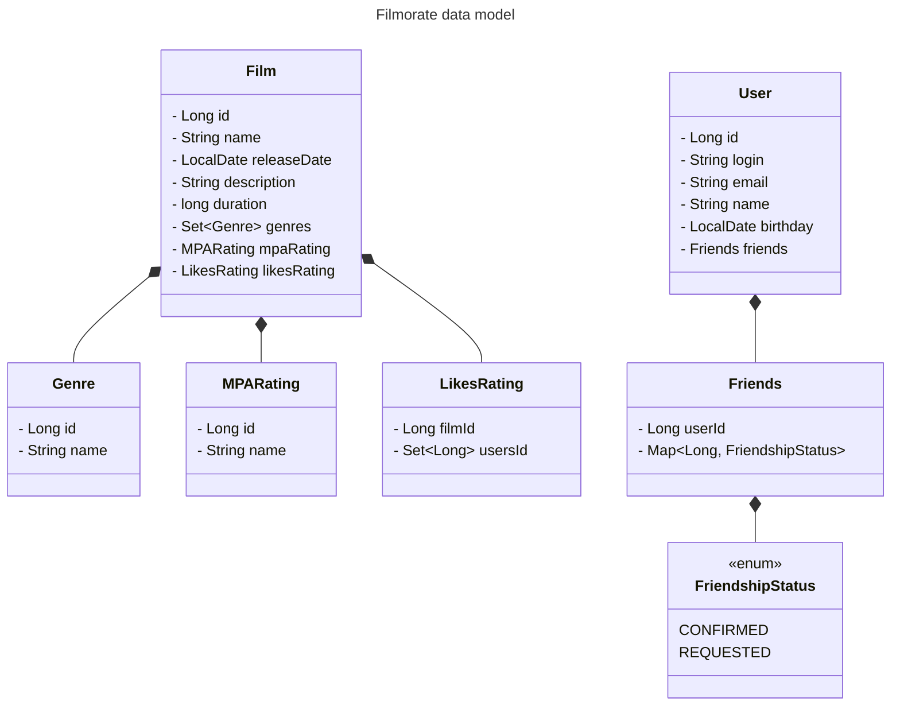

# java-filmorate
Template repository for Filmorate project.

# filmorate_db

Проект базы данных для приложения Filmorate проектируемого в Яндекс Практикуме

<!-- Структура каталогов репозитория -->

 Структура проекта 

- :file_folder: dbml_src - исходный код в формате .dbml для dbdiagram.io
- :file_folder: diagrams - изображения .png .svg диаграмм базы данных проекта
- :file_folder: sql_scripts - сгенерированные sql-скрипты

---

## Модель данных приложения Filmorate
<!-- Описание модели приложения -->
>Модель данных состоит из основных классов представляющих собой Пользователей и Фильмы, а также дополнительных: Жанр фильма, MPA-рейтинг, "Лайк"-рейтинг, Друзья и Статус запроса пользователей на добавление в друзья.
>

 Визуализация диаграммы классов

---

## Диаграмма базы данных
<!-- Описание схемы базы данных -->
>Исходя из модели данных спроектированы основные таблицы:

- фильмы(films);
- жанр фильма(film_genre);
- жанры(genres);
- MPA-рейтинг(mpa_rating);
- лайк-рейтинг(likes_rating);
- пользователи(users);
- друзья(friends).

>Дополнительные таблицы позволяют реализовать связи между свойствами моделей.

*Таблица соответствия свойств модели и базы данных*

|Свойство модели     |Тип связи        |Таблица      |
|:---                |:--:             |:---:        |
|МРА-рейтинг фильма  |один ко многим   |MPA-рейтинг  |
|Лайк-рейтинг        |многие ко многим |лайк-рейтинг |
|жанры фильма        |многие ко многим |жанр фильма  |
|друзья пользователей|многие ко многим |дружба       |

 Визуализация диаграммы 

<!-- Диаграмма экспортирована из dbdiagram.io -->

